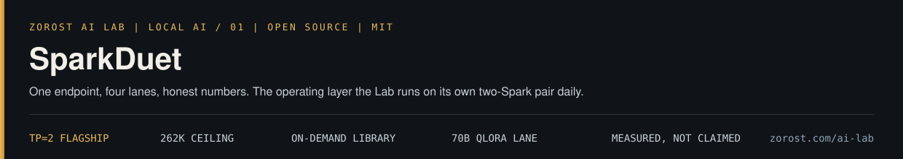
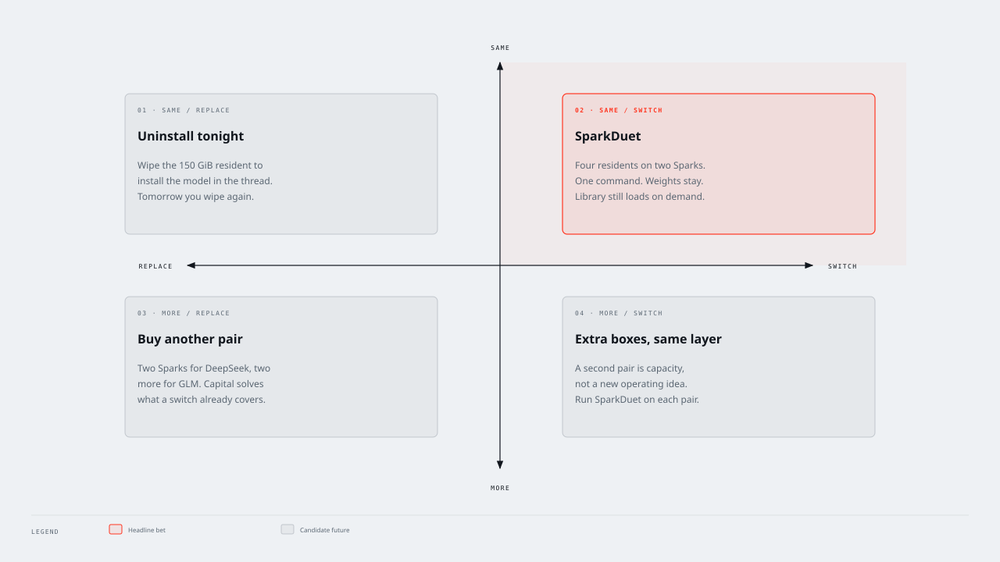
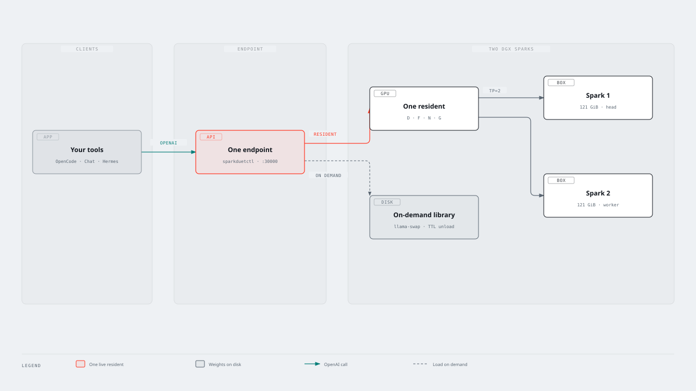
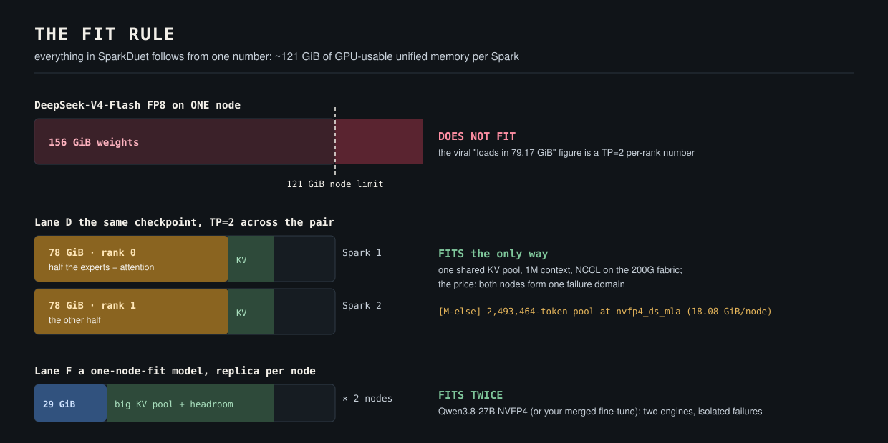
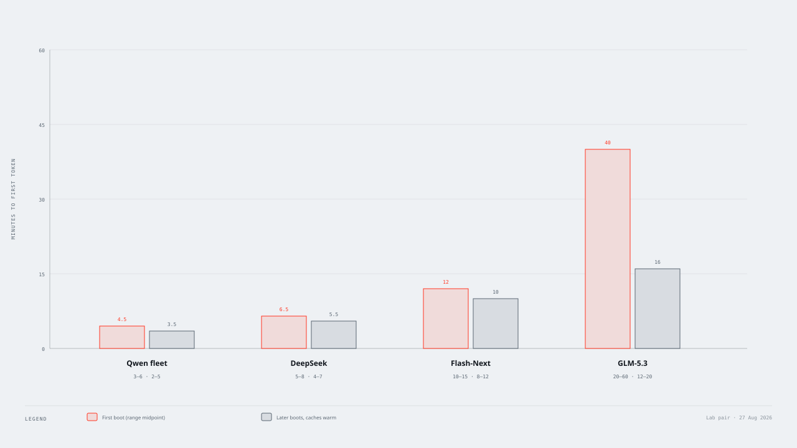
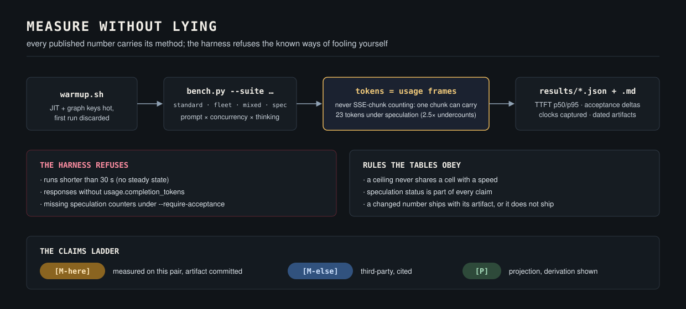

<div align="center">

[](https://zorost.com/ai-lab/local-ai/sparkduet)

**( Local AI / 01 )** · Open Source · MIT · a [Zorost AI Lab](https://zorost.com/ai-lab) project

# SparkDuet

**Four frontier residents on two NVIDIA DGX Sparks. One OpenAI port. One command to swap.**

DeepSeek-V4-Flash, Qwen 27B, Qwen3.8-Flash-Next, and GLM-5.3-Flash stay on disk.
RAM holds one. You do not uninstall a 150 GiB checkpoint to try the next one,
and you do not buy a second pair to keep a second MoE warm. The operating layer
the Lab runs on its own pair daily. Full write-up:
[zorost.com/ai-lab/local-ai/sparkduet](https://zorost.com/ai-lab/local-ai/sparkduet)

[](https://github.com/zorost/sparkduet/actions/workflows/validate.yml)
[](LICENSE)
[-76b900.svg)](#quick-start)
[](#the-default-flagship-profile)
[](#the-default-flagship-profile)

[Lab page](https://zorost.com/ai-lab/local-ai/sparkduet) ·
[Quick start](#quick-start) ·
[The fit rule](#the-fit-rule-read-this-before-anything-else) ·
[Benchmarks](#measured-projected-or-hearsay) ·
[Fine-tuning](finetune/README.md) ·
[How it compares](docs/COMPARISON.md)

</div>

Two DGX Sparks give you 256 GB of unified GPU memory, a 200 Gb/s private
interconnect, and a problem the rest of the field still solves the expensive
way. Published recipes treat the pair as one big GPU for one model, all day.
Owners then uninstall that model to try the next one, or they buy a second
pair so DeepSeek and GLM never share a wall. SparkDuet treats the pair as a
small cluster with **lanes**: pick the topology per model, switch in one
command, revert in one command, and measure in a way you can publish.

That is the product. The hardware is already a pair. The innovation is that
the pair can host four residents and an on-demand library without becoming
four appliances.

What that means on the same two boxes, in the same day:

- Serve **DeepSeek-V4-Flash** (284B MoE) across both nodes at 68-72 tok/s on
  code and math [M-here], measured, artifacts committed.
- `switch fleet` for two **Qwen 27B** replicas, one per box.
- `switch next` for **Qwen3.8-Flash-Next** NVFP4 (Lane N, TP=2) on
  [`lane-n-flash-next`](https://github.com/zorost/sparkduet/tree/lane-n-flash-next).
- `switch glm` for **GLM-5.3-Flash** NVFP4 (Lane G, TP=2) on
  [`lane-g-glm-flash`](https://github.com/zorost/sparkduet/tree/lane-g-glm-flash).
- Keep the rest of the library (**GGUF**, merged fine-tunes) loading
  **on demand** without touching the resident.
- **Fine-tune** up to ~70B with QLoRA on the node that is not serving.
- Put it all back **exactly the way it was** with `revert`.

One resident in unified memory. The other checkpoints sit on NVMe. Confirm is
`/v1/models` plus a short completion, not the container `Up` line.

The field still solves this the expensive way: uninstall a 150 GiB checkpoint
to try the next one, or buy a second pair so two MoEs never share a wall.
SparkDuet is the switch. Full article:
[zorost.com/ai-lab/local-ai/sparkduet](https://zorost.com/ai-lab/local-ai/sparkduet).





## Contents

- [The fit rule](#the-fit-rule-read-this-before-anything-else)
- [The lanes](#the-lanes)
- [Wall clock to first token](#wall-clock-to-first-usable-token)
- [The full recipe](#the-full-recipe)
- [Quick start](#quick-start)
- [The default flagship profile](#the-default-flagship-profile)
- [Point your tools at it](#point-your-tools-at-it) (OpenCode, Cursor, Hermes, DeepSeek CLI)
- [Fine-tuning](#fine-tuning-the-other-half-of-the-pair)
- [Swapping models and branches](#when-the-next-model-drops)
- [Running it cool](#running-it-cool)
- [Measured numbers](#measured-projected-or-hearsay)
- [How it compares](#how-it-compares-to-the-other-dgx-spark-recipes)
- [Repository map](#repository-map)

## The fit rule (read this before anything else)

Everything in this repo follows from one number: a DGX Spark exposes
**~121 GiB** of GPU-usable unified memory.



| Checkpoint | Weights on disk | Fits one node? | Lane |
|---|---:|:---:|---|
| DeepSeek-V4-Flash-0731 FP8 (official) | ~156 GiB | **No** | **D only** (TP=2, both nodes) |
| DeepSeek-V4-Flash-0731 GGUF Q2/Q3 | ~108 GiB | Yes, barely | F or on-demand swapper |
| Qwen3.8-Flash-Next NVFP4 (RadixArk) | ~135 GiB | **No** | **N only** (TP=2, both nodes) |
| GLM-5.3-Flash NVFP4 (LibertAIDAI) | ~181 GiB | **No** | **G only** (TP=2, `G_ENGINE=vllm`) |
| GLM-5.3-Flash EXL3/TR3 4bpw (brandonmusic) | ~164 GiB | **No** | **G only** (TP=2, `G_ENGINE=exl3`) |
| Qwen3.8-27B (NVFP4 / FP8) | ~29 GiB | Yes, easily | F (a replica per node), P |
| Anything ≤ ~90 GiB | varies | Yes | F, P, or single-node |

An earlier ecosystem claim that the FP8 flagship "loads in 79 GiB on one node"
misread a TP=2 *per-rank* number; the checkpoint does not fit one Spark. We
document the correction with the arithmetic in `docs/ARCHITECTURE.md` §3, and
the lane configs enforce the rule instead of letting you discover it at OOM
time, twenty minutes into a model load.

## The lanes

**Lane D, Depth (TP=2).** One model too big for one box, sharded across both
over the 200G RoCE link. This is how the pair serves the 284B-parameter
(13B-active) DeepSeek-V4-Flash with DSpark speculative decoding. We serve a
262K ceiling and advertise 85% of it to clients so harness session compaction
always has headroom; the image's nvfp4 KV cache supports up to 1M if you
raise `D_GPU_MEM_UTIL` and accept the KV/weights trade [M-else]. Worker-first
launch, NCCL preflight gate, warm-up before first traffic, and two idempotent
container-start hotfixes from the community recipe lineage (truncated tool
calls, stops inside reasoning; see `patches/README.md`).

**Lane N, Next (TP=2).** The same two-box split as Lane D, pointed at
Qwen3.8-Flash-Next NVFP4. `N_ENGINE` picks the file: `vllm` (no speculation
on this checkpoint) or `sglang` (NEXTN drafts from the in-checkpoint MTP
layer). Both keep the same `:30000` hop, container names, and served id.
The Lab pair runs `N_ENGINE=sglang`. vLLM uses
`vllm/vllm-openai:qwen38-flash-next` plus `next-ple-fp8.py` so the ModelOpt
hybrid PLE loads. SGLang uses the SM121-patched image from
`patches/next-sglang-sm121/`; stock `lmsysorg/sglang:qwen38flashnext`
either fails to compile or silently decodes token id 0. The image also
aborts leftover `!` loops after that kernel (MiaAI-Lab `0f95001`) so a
long thinking decode cannot poison later radix hits. `switch next`
drains the incumbent; `switch depth` puts the flagship back. Weights:
`prepare-models.sh --model flash-next`.

**Lane G, GLM (TP=2).** Same split, same hop, two quantizations of Z.ai
GLM-5.3-Flash (320B / 18B-active, vision, MIT). `G_ENGINE=vllm` is
LibertAIDAI NVFP4 (~181 GiB) on `vllm/vllm-openai:glm53-flash-arm64-cu130`.
`glm-entry.sh` installs FlashInfer 0.6.18 and selects the SM90 NoPE MLA
path; stock 0.6.17 collapses completions to token 1023. `G_ENGINE=exl3`
is brandonmusic EXL3/TR3 4bpw (~164 GiB, ShapleyMcg License v1.0) on the
MiaAI-Lab overlay. The Lab pair runs `G_ENGINE=exl3` for quality per byte
(teacher-logit KLD 0.024555 nats vs NVFP4 0.060535). DFlash2 stays out:
those weights are CC BY-NC-ND. Both engines speculate with MTP.
`switch glm` / `switch depth`. Weights: `prepare-models.sh --model glm-flash`
or `--model glm-exl3`.

**Lane F, Fleet (DP=2).** Two independent replicas of a model that fits one
node, one per Spark, load-balanced by the router. No cross-node collective on
the serving path: a node failure degrades capacity by half instead of taking
the service down. The right lane for agent fleets and team serving.

**Lane P, Split (prefill/decode disaggregation), experimental.** One node
ingests long prompts, the other holds the KV pool and decodes. The 200G link
moves a 128K-token KV in under a tenth of a second, so long-prompt arrivals
stop stalling everyone's decode. Ships behind an explicit enable flag with its
failure semantics documented; benchmark it on your pair before trusting it.

**Fine-tune lane.** The node that is not serving is a 128 GB training box:
QLoRA up to ~70B, LoRA to ~27B, full fine-tune to ~7B, with a three-minute
smoke test that asserts loss actually falls before you commit a weekend. Both
nodes together run distributed fine-tunes over the same fabric NCCL uses for
serving. See `finetune/README.md`.

**SpecAdvisor.** DSpark draft acceptance is workload-dependent (we measured
0.78 on math and 0.23 on prose on the same engine). The advisor watches the
engine's real acceptance counters and recommends the throughput-optimal draft
depth `k` within the cuda-graph budget. Recommendations are logged and
exposed; applying one is an explicit engine restart, because that is what
changing `k` actually requires. No magic, no pretend hot-swap.

## Wall clock to first usable token

Confirm is a short completion on a new chat, not `docker ps` saying Up.
Measured on the Lab pair on 27 Aug 2026. First-boot column is a cold or
first-of-session load. Later is caches warm. Do not fire a second switch
while Booting is still the state.



| Swap | First boot | Later (caches warm) | What you wait on |
|---|---|---|---|
| Qwen fleet | 3–6 min | 2–5 min | 27B replica per box. Fastest. |
| DeepSeek | 5–8 min | 4–7 min | 156 GiB TP=2. Tonight: ~6 min to API. |
| Flash-Next | 10–15 min | 8–12 min | 126 GiB + PLE + MoE autotune. Tonight: 12 min. |
| GLM-5.3 | 20–60 min | 12–20 min | 181 GiB + FlashInfer 0.6.18. First honest boot is the long one. |

After READY, run `./scripts/warmup.sh`, then open a **new** chat. Old threads
that saw the previous engine die stay poisoned.

## The full recipe

Two DGX Sparks, QSFP cabled, SSH from head to worker, ~170 GiB free disk per
node for the flagship plus room for the other residents you want to swap.

```bash
git clone https://github.com/zorost/sparkduet && cd sparkduet
./install.sh                          # fabric IPs, sparkduet.env, worker sync, gates

./scripts/sparkduetctl.sh doctor      # SSH, fabric, RDMA, disk, images
./scripts/nccl-check.sh --full        # 2-node all-reduce ≥ 8 GB/s

# Stage every resident you plan to swap. Weights stay. RAM holds one.
./scripts/prepare-models.sh --model deepseek
./scripts/prepare-models.sh --model qwen
./scripts/prepare-models.sh --model flash-next
./scripts/prepare-models.sh --model glm-flash

./scripts/sparkduetctl.sh start depth # worker first, head, health gate
./scripts/warmup.sh                   # do not skip
# Point OpenCode, Chat, Hermes, Cursor at the OpenAI port in docs/RUNBOOK.md
python3 scripts/bench.py --suite standard --lane depth

# Swap. One at a time. Wait the table above. New chat after Confirm.
./scripts/sparkduetctl.sh switch fleet
./scripts/sparkduetctl.sh switch next    # lane-n-flash-next
./scripts/sparkduetctl.sh switch glm     # lane-g-glm-flash
./scripts/sparkduetctl.sh switch depth   # flagship back
./scripts/sparkduetctl.sh revert         # undo the last start
```

`start` refuses until `doctor` passes. Every start captures the incumbent so
`stop` and `revert` put the boxes back. If something you care about is already
up, run `./scripts/sparkduetctl.sh capture-incumbent` first.

Flash-Next first boot applies `patches/next-ple-fp8.py` at container start.
GLM first boot applies `patches/glm-entry.sh` (FlashInfer 0.6.18) and
`patches/glm53-sm90.py`. Both are idempotent. Details in `patches/README.md`.

## Quick start

Requirements: 2x DGX Spark (or any two CUDA boxes with a fast link), DGX OS
with Docker, the QSFP link cabled, SSH from head to worker, ~170 GiB free disk
per node for the flagship model.

```bash
git clone https://github.com/zorost/sparkduet && cd sparkduet
./install.sh                 # detects fabric IPs/interfaces, writes sparkduet.env,
                             # syncs the repo to the worker, runs the gates
```

Or by hand:

```bash
cp configs/sparkduet.env.example sparkduet.env
$EDITOR sparkduet.env        # 8 required lines: addresses, interface names, paths

./scripts/sparkduetctl.sh doctor        # gates: SSH, fabric, RDMA, disk, images
./scripts/nccl-check.sh --full          # proves a real 2-node all-reduce ≥ 8 GB/s
./scripts/prepare-models.sh --model deepseek   # or --sync-worker <dir> over the fabric
./scripts/sparkduetctl.sh start depth   # worker first, then head, then health gate
./scripts/sparkduetctl.sh switch next   # drain DeepSeek, boot Flash-Next (lane-n-flash-next)
./scripts/warmup.sh                     # JIT & cuda-graph warm-up, do not skip
python3 scripts/bench.py --suite standard --lane depth
```

`start` refuses to run until `doctor` passes. Every start captures the state
needed to revert; `sparkduetctl.sh stop` returns the boxes to exactly what ran
before. If you already serve something you care about, run
`./scripts/sparkduetctl.sh capture-incumbent` first: it snapshots every running
container's full spec to a dated file so "put it back the way it was" is a
paste, not an archaeology project.

## The default flagship profile

So you know exactly what you are dealing with before the first boot, this is
the out-of-the-box Lane D recipe. Every knob lives in `sparkduet.env`
(annotated in `configs/sparkduet.env.example`); nothing is hardcoded.

| Knob | Default |
|---|---|
| Engine image | [`ghcr.io/anemll/dspark-vllm-gx10:0.1.1`](https://github.com/Anemll/dspark-vllm-gx10), Anemll's vLLM 0.25 port for GB10/sm_121a |
| Checkpoint | `deepseek-ai/DeepSeek-V4-Flash-0731`, FP8 weights, ~156 GiB on **each** node |
| Topology | TP=2 across both Sparks, `mp` backend, worker boots first |
| Context ceiling | `D_MAX_MODEL_LEN=1048576` (a ceiling, not a reservation). This pair at util 0.78 reports a **1,014,644**-token KV pool [M-here, `results/2026-08-29-depth-1m-ceiling.md`]. That is 0.97× a full 1M request, so pickers advertise 862447 (85% of the pool), not 1M. |
| Concurrency | `D_MAX_NUM_SEQS=6`, batch `8192` tokens, long-prefill chunk cap `1024` |
| KV cache | `nvfp4_ds_mla`, utilization `0.75` (raise to `0.835` on a dedicated pair) |
| Speculation | DSpark, `k=5` static default; `specadvisor.py` measured `k=7` optimal on our workload mix [M-here] |
| Reasoning and tools | `deepseek_v4` reasoning and tool-call parsers on, auto tool choice on |
| Boot-time hotfixes | truncated tool-call guard and stops-dormant-in-reasoning, applied idempotently at container start (`patches/README.md`, credited) |
| Fabric hardening | UCX registration-cache bounds against the community-documented unified-memory leak under sustained TP=2 load |
| Boot hardening | Triton, TileLang, and CuTeDSL JIT caches persist on the cache volume across recreates; the post-ready warmup covers decode shapes and every sampler family; the NCCL flight recorder is armed, dumping per-rank traces on watchdog timeout |

The ceilings interact: `max_model_len` and `max_num_seqs` are limits, and the
real constraint is the shared KV pool (see the boot log's own
"GPU KV cache size" line, and trust it over any README). The complete pinned
recipe for this checkpoint, including the swap checklist to leave it, lives on
the [`model/deepseek-v4-flash-0731`](../../tree/model/deepseek-v4-flash-0731)
branch.

## Point your tools at it

Everything speaks the OpenAI API on one port. Working configs for the four
harnesses we run daily are in `docs/RUNBOOK.md`:

- **OpenCode**, `provider` block with the endpoint and both model IDs
- **Cursor**, OpenAI-compatible base URL override
- **DeepSeek CLI**, `DEEPSEEK_BASE_URL` + served model name
- **Hermes**, endpoint + model in `hermes.toml`

The router exposes lanes as model suffixes (`model@fleet`) or headers
(`X-SparkDuet-Lane`), so a harness can pin a lane per request without any
client-side code.

## Fine-tuning: the other half of the pair

`finetune/README.md` is a complete walkthrough: shape a JSONL dataset, train
a LoRA on a 4B in minutes with `finetune/train-lora.py`, scale the same
command to 27B LoRA or 70B QLoRA, merge, and serve the result behind the same
endpoint, resident on Lane F or on-demand as GGUF. The verified smoke run on
this pair took loss from 2.12 to 0.21 in 81 seconds on the worker node.

## When the next model drops

DeepSeek-V4-Flash is the flagship today, not forever. Model identity lives in
env, not in code, and each complete recipe lives on a `model/*` branch
(`model/deepseek-v4-flash-0731`, `lane-n-flash-next`, yours next). `main` always carries the
scaffold plus the current flagship's recipe; the model branch is the pinned
snapshot for that checkpoint, so it keeps working after `main` moves on to the
next model. Today the two match. The 30-minute swap checklist, the retuning
table, and the branch convention are in `docs/MODEL-SWAP.md`.

## Running it cool

A Spark pair at full serve is warm and audible; there is no reason to keep it
there around the clock.

- `./scripts/sparkduetctl.sh stop` unloads the lanes; idle draw drops to
  single-digit watts per GPU and fans settle.
- On-demand beats resident: the llama-swap library loads a model when called
  and unloads it after a TTL, so the box only heats up while it works.
- Off is a supported state: shut the pair down overnight
  (`sudo systemctl poweroff` on each node, or your command center's Off
  button) and cold-boot in the morning; the persisted JIT/autotune caches make
  the first request fast again. Note DGX Spark has no Wake-on-LAN; power-on is
  the chassis button or a smart plug with Restore-on-AC enabled.
- Training is the exception: it pins the GPU for hours by design. Schedule it
  in `finetune/README.md`'s serving windows and stop the lane after.

## Measured, projected, or hearsay



Every number in this repo carries a label. **[M-here]** was measured on our
pair by `scripts/bench.py`, with the JSON artifact committed to `results/`.
**[M-else]** is third-party, cited. **[P]** is a projection with its derivation
shown. The benchmark protocol (`docs/BENCHMARK-PROTOCOL.md`) is binding: token
counts come from `usage.completion_tokens`, never from counting SSE chunks
(a mistake that has already produced one viral 2.5x undercount in this
ecosystem); TTFT is reported p50/p95; speculative acceptance is captured from
engine counters over the same window as every cell; short runs are refused.

First-party numbers from this pair, committed under `results/`. Lane D is
DeepSeek-V4-Flash FP8, TP=2 across both Sparks, DSpark speculation k=5,
`gpu_memory_utilization=0.72` at the 25 Aug decode suite (the running
config has since moved to 0.78). The 29 Aug 1M-ceiling boot at 0.78 left
a 1,014,644-token KV pool [M-here]. Lane N rows below are the 29 Aug
suite with `enable_thinking` actually off. Artifacts state their own
settings:

<!-- ladder: M-here -->

| Setup | Workload | Result [M-here] |
|---|---|---|
| Lane D, 2 nodes | math, c=1 | 72.2 tok/s (acceptance 0.78) |
| Lane D, 2 nodes | code, c=1 | 68.1 tok/s (acceptance 0.70) |
| Lane D, 2 nodes | tool calls, c=1 | 51.2 tok/s (acceptance 0.50) |
| Lane D, 2 nodes | prose, c=1 | 33.6 tok/s (acceptance 0.23) |
| Lane D, 2 nodes | 218-token synthetic, c=6 | 88.7 tok/s aggregate |
| Lane D, 2 nodes | 29K-token synthetic, c=1 | 6.2 tok/s, TTFT p50 17.1 s |
| Lane N SGLang NEXTN, 2 nodes | math, c=1, thinking off | 50.5 tok/s |
| Lane N SGLang NEXTN, 2 nodes | code, c=1, thinking off | 47.8 tok/s |
| Lane N SGLang NEXTN, 2 nodes | tool, c=1, thinking off | 49.0 tok/s |
| Lane N SGLang NEXTN, 2 nodes | prose, c=1, thinking off | 36.3 tok/s |
| Lane D, 2 nodes, util 0.78 | 1M ceiling boot | KV pool 1,014,644 tokens, 0.97× of 1048576 |
| Qwen3.8-27B NVFP4, vLLM, 1 node | 256 tok, c=1 | 12.8 tok/s (no speculation) |
| Qwen3.8-27B NVFP4, vLLM, 1 node | 256 tok, c=4 | 46.9 tok/s aggregate |
| Qwen 27B GGUF Q5 via llama-swap, 1 node | 256 tok, c=1 | 10.1 tok/s |

Read the spread as the headline: the same deployment is 72 tok/s on math and
34 tok/s on prose, because speculative decoding lives and dies by draft
acceptance. Any two-Spark tok/s claim that omits the workload class and
speculation status is not comparable to anything. The Qwen baseline was
measured while that node also carried its normal daily serving load;
artifacts carry the full context, including one acceptance-counter scraper
bug we shipped, caught, and corrected the same night (the artifact documents
the exact correction).

<!-- ladder: end -->

## How it compares to the other DGX Spark recipes

Short version: MiaAI-Lab's recipe is the reference for serving this one model
deeply, and if that is your whole job, run it as shipped. SparkDuet runs the
same lineage as one lane and adds the rest of what a pair is for: the
on-demand library, the fine-tune lane, reversibility, and per-workload
measurement. The full praise-forward, regime-by-regime table with both sides'
boot lines is in `docs/COMPARISON.md`.


## Repository map

```text
sparkduet/
├── README.md                  ← you are here
├── install.sh                 # interactive bootstrap (env, sync, gates)
├── configs/
│   ├── sparkduet.env.example  # every knob, one file, validated at start
│   ├── lane-depth.compose.yml # TP=2 head+worker (the flagship lane)
│   ├── lane-next.compose.yml  # TP=2 Flash-Next vLLM (N_ENGINE=vllm)
│   ├── lane-next-sglang.compose.yml  # same hop, NEXTN (N_ENGINE=sglang)
│   ├── lane-glm.compose.yml   # TP=2 GLM NVFP4 (G_ENGINE=vllm)
│   ├── lane-glm-exl3.compose.yml     # same hop, EXL3 (G_ENGINE=exl3)
│   ├── lane-fleet.compose.yml # DP=2 replicas (one-node-fit models)
│   └── lane-pd.compose.yml    # prefill/decode split (experimental)
├── scripts/
│   ├── sparkduetctl.sh        # doctor / start / stop / switch / status / revert
│   ├── nccl-check.sh          # fabric go/no-go gate (link, RDMA, all-reduce)
│   ├── prepare-models.sh      # pinned downloads or head→worker fabric sync
│   ├── warmup.sh              # JIT & cuda-graph warm-up
│   ├── bench.py               # the honesty harness (suites, TTFT, acceptance)
│   ├── router.py              # optional lane arbiter, stdlib only
│   ├── specadvisor.py         # acceptance watcher + draft-depth advisor
│   └── test_*.py              # CPU-only unit tests (CI runs these)
├── finetune/
│   ├── README.md              # the full walkthrough: data → train → merge → serve
│   ├── finetune.compose.yml   # Unsloth workbench container
│   ├── train-smoke.py         # 3-minute loss-falls gate
│   └── train-lora.py          # the real parameterized trainer
├── docs/
│   ├── ARCHITECTURE.md        # the design and the arithmetic behind it
│   ├── RUNBOOK.md             # day-2 ops + harness configs
│   ├── BENCHMARK-PROTOCOL.md  # binding measurement rules
│   ├── COMPARISON.md          # vs the other DGX Spark recipes, regime by regime
│   ├── MODELS.md              # choosing checkpoints for this hardware
│   ├── MODEL-SWAP.md          # the 30-minute swap checklist + branch convention
│   ├── FIELD-NOTES.md         # deployment lessons from live clusters
│   ├── RESEARCH.md            # the sourced evidence base
│   └── diagrams/              # four-on-two, swap state, field, boot times, fit, honesty
├── patches/                   # DeepSeek hotfixes, Flash-Next PLE/SGLang SM121, GLM FlashInfer + EXL3
└── results/                   # dated benchmark artifacts (JSON + markdown)
```

## What this is not

- Not an inference engine. vLLM (via a pinned, community-maintained image for
  the GB10's sm_121a) does the serving; SparkDuet decides what runs where,
  proves the fabric before trusting it, and measures honestly.
- Not a managed product. No auth, no TLS, no multi-tenancy: put your own
  gateway in front (see `SECURITY.md`).
- Not a benchmark-winning machine. Where another recipe or engine is better
  for your case, `docs/COMPARISON.md` says so and links it.

## Standing on shoulders

The two-node DeepSeek-on-Spark lineage this builds on, and every measurement
we cite, is credited in `CREDITS.md` and sourced in `docs/RESEARCH.md`. The
short version: MiaAI-Lab proved the TP=2 recipe and its results culture;
Anemll maintains the image line; the DGX Spark forum community did the
kernel-level heavy lifting. SparkDuet's contribution is the lane model, the
fit-rule honesty, the fine-tuning integration, and tooling that refuses to
publish a number it cannot defend.

SparkDuet is built and maintained at [Zorost AI Lab](https://zorost.com/ai-lab).
The Lab page for this project is
[zorost.com/ai-lab/local-ai/sparkduet](https://zorost.com/ai-lab/local-ai/sparkduet).
The numbers in `results/` come from that pair.

MIT license. Weights and images carry their own licenses.

---

*If you are searching for: NVIDIA DGX Spark cluster setup, DGX Spark 2 node
inference, DeepSeek on DGX Spark, vLLM tensor parallel DGX Spark, GB10 LLM
serving, DGX Spark fine-tuning with Unsloth, local LLM server for coding
agents, llama-swap on-demand models, this repo is that, with the measurements
attached.*
