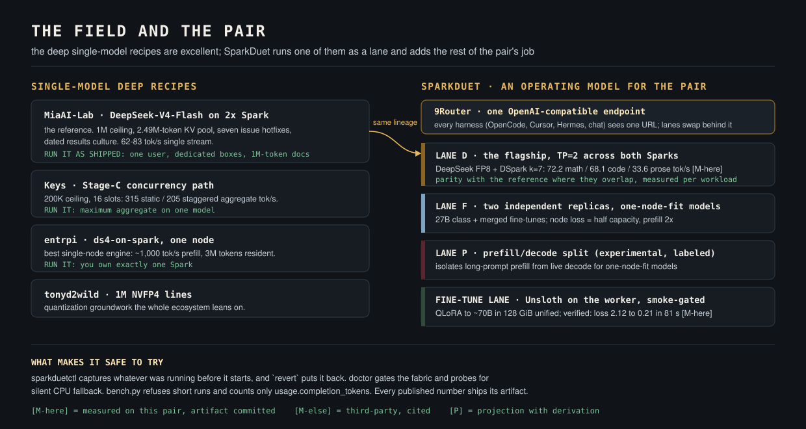

# SparkDuet vs the other DGX Spark recipes

People run serious inference on 2x DGX Spark today because a small group of
builders did the hard work in public: MiaAI-Lab's DeepSeek recipe, the Anemll
image line, Keys' concurrency patches, tonyd2wild's NVFP4 work, entrpi's
single-node engine. SparkDuet exists because of that work, not instead of it.
Lane D literally runs the same image lineage they proved. This page states
where each project is the right choice, and what SparkDuet adds on top.



Ladder labels: **[M-here]** measured by this repo's harness (artifact in
`results/`), **[M-else]** third-party measured (source cited), **[P]**
projection with derivation in `docs/ARCHITECTURE.md`.

---

## 1. Start with the reference: MiaAI-Lab's recipe is excellent

[MiaAI-Lab/DeepSeek-v4-Flash-DSpark-2x-DGX-Spark](https://github.com/MiaAI-Lab/DeepSeek-v4-Flash-DSpark-2x-DGX-Spark)
is the definitive way to put DeepSeek-V4-Flash-0731 on a Spark pair, and its
955 stars are earned. Three things it does better than anyone, including us:

1. **Hotfix engineering.** Issues #22, #26, #27, #31, #43, #55, #79 are each
   diagnosed, patched at container start, and documented with opt-outs. The
   #27 prefill cap (one in-flight long prefill, 1024-token chunks) is why six
   huge cold prompts queue politely instead of starving decode. The #55 fix
   makes truncated tool calls report `finish_reason: "length"` instead of
   poisoning agent transcripts. This is production-grade care.
2. **The 1M-token ceiling, for real.** Their default profile boots
   `max_model_len=1048576` at utilization 0.835 with a measured
   2.49M-token KV pool [M-else]. If your workload is one person reading
   million-token documents, run their recipe as shipped.
3. **Results culture.** Dated results files, method described, regressions
   tracked across releases. Their "what speed to expect" table separates
   short-chat aggregate from cold-128K wall time, which most tables gloss over.

We reuse their lineage directly: the pinned image family, `nvfp4_ds_mla` KV,
DSpark speculation, worker-first launch, `VLLM_USE_BREAKABLE_CUDAGRAPH=0`,
capture-size = seqs x (k+1). Attribution lives in `CREDITS.md`.

## 2. What SparkDuet adds: the pair as a system, not a single recipe

Mia's repo answers "how do I serve this one model as fast as possible."
SparkDuet answers "how do I run my whole AI workload on two Sparks":
serve the flagship, keep a library of smaller models on demand, fine-tune
between serving windows, switch or revert in one command, and measure
everything you claim. One endpoint in front, four lanes behind it.

| | MiaAI-Lab recipe | **SparkDuet** |
|---|---|---|
| Scope | One model, served deeply | The pair as an operating system for models |
| Topology | TP=2 | TP=2 (Lane D) + DP=2 fleet (Lane F) + PD-split (Lane P, experimental) + fine-tune lane |
| Models at once | DSV4F only (optional VL sidecar) | DSV4F **and** an on-demand library (Qwen 27B GGUF and friends via llama-swap) **and** your fine-tunes |
| Model swap | edit env, restart | `sparkduetctl.sh switch <lane>` with drain, or a `model/*` branch checkout; incumbent capture + `revert` restores whatever ran before |
| Fine-tuning | out of scope | first-class lane: Unsloth on the worker, smoke-gated, verified run in `results/` [M-here] |
| Speculation | static k=5 | measured per-workload acceptance; advisor recommends k from {3,5,7}; applied honestly via restart (k=7 live now) |
| Benchmarks | prompt x concurrency sweeps | per-workload-class suites (math, code, tool-calling, prose) with acceptance attached, refusal-enforced protocol |
| Ops | start/stop/status/logs scripts | + doctor gates (fabric, CUDA fallback probe), nccl-check, warmup, JIT-cache persistence, incumbent capture/revert |
| Context default | 1M ceiling, util 0.835, dedicated boxes | 128K ceiling, util 0.78, head node shares a gateway stack; 1M capable, see below |

## 3. Numbers, side by side, with configs attached

Decode speed is workload-shaped when speculation is on: draft acceptance is
what moves tok/s, and acceptance depends on how predictable the text is. Both
projects run the same model family on the same silicon, so parity is what an
honest table shows in the overlapping regime.

### Single-stream decode, 2x Spark TP=2, DSpark speculation

| Workload | MiaAI-Lab [M-else] | SparkDuet [M-here] | Acceptance [M-here] |
|---|---|---|---|
| Math | in the 62-83 band | **72.2 tok/s** | 0.78 |
| Code | in the 62-83 band | **68.1 tok/s** | 0.70 |
| Tool-calling | not broken out | **51.2 tok/s** | 0.50 |
| Prose | not broken out | **33.6 tok/s** | 0.23 |

Mia's README quotes "~62-83 decode tok/s after first token" for one chat
through 128K [M-else]. Our math and code rows land inside that band on the
same architecture; that is the parity you should expect. What their table
does not break out, and ours does, is that prose decodes at half of code speed
*on the same engine at the same settings*, purely because draft acceptance
falls from 0.70 to 0.23. If you plan capacity from a single "82 tok/s"
headline, prose-heavy agents will disappoint you. Artifacts:
`results/2026-08-25-deepseek-v4-flash-tp2-laneD-*`.

### KV pool and context: read your own boot line

| | MiaAI-Lab boot [M-else] | SparkDuet boot [M-here] |
|---|---|---|
| Ceiling | 1,048,576 tokens | 131,072 tokens |
| GPU util | 0.835 (dedicated pair) | 0.78 (head node also runs a gateway stack) |
| KV pool | 18.08 GiB = 2,493,464 tokens | 10.97 GiB = 395,259 tokens |
| Full-ctx concurrency | 2.38x of 1M | 3.02x of 128K |

Two honest caveats. First, the pools are not directly comparable per GiB:
draft-model and indexer state for the deeper speculation config we run (k=7
live) eat into the same budget, and per-token KV cost differs with
configuration. Second, ours is a *choice*, not a limit: we verified 0.82 util
= 590,567 tokens on the same pair [M-here], and the engine accepts a 1M
ceiling if you dedicate the boxes the way Mia's default assumes. We keep 0.78
because 15 GiB of host headroom is what lets one box also run the router,
Open WebUI, Caddy, and a Telegram bot without earlyoom roulette. That
three-way trade (KV pool, host headroom, co-resident services) is the real
tuning story on unified memory, and `docs/MODELS.md` walks it.

### What only one of the two repos measures at all

| Capability | Result [M-here] | Artifact |
|---|---|---|
| On-demand 27B GGUF while the flagship idles | 9.7 tok/s, llama-swap cold-load | `results/2026-08-25-qwen27b-gguf-spark2-ondemand-standard-CLEAN.*` |
| Same server during a TP=2 rank load (contention) | 1.4-2.2 tok/s, GPU silently lost [M-here] | `results/...CONTENDED-laneD-boot-*` and `docs/FIELD-NOTES.md` §5 |
| QLoRA fine-tune smoke on the worker | loss 2.12 -> 0.21 in 81 s | `finetune/` lane, run log in `results/` |
| NCCL fabric after container RDMA fix | 42.0 GB/s bus BW (was 4.0 silently on TCP) | `scripts/nccl-check.sh` output |

## 4. Where the others win, and we say so

- **One Spark only?** entrpi's ds4-on-spark is the best single-node engine in
  this ecosystem (prefill ~1,000 tok/s, 3M tokens resident, typed memory
  refusals) [M-else]. SparkDuet is unapologetically a two-node system.
- **One person, million-token documents, dedicated boxes?** Run Mia's recipe
  as shipped. Their 1M/0.835 default is tuned for exactly that, and their
  thinking-budget hotfixes matter for long reasoning sessions. (Their #55
  tool-truncation and stops-in-reasoning fixes now ship in our `patches/`
  too, applied at container start, credited.)
- **Maximum aggregate throughput?** Keys' Stage-C path (200K ceiling, 16
  slots) posts 315 static / 205 staggered [M-else]. Mia's repo documents the
  overlay; ours does not ship it. If you need that regime, follow their
  Stage-C section.
- **Four boxes?** TP=4 measured ~70 tok/s single-stream with 4,000 tok/s
  prefill at 500K [M-else, NVIDIA forums]. Lane D's configs are parameterized
  for it, but we have not run it.

## 5. Where SparkDuet is structurally ahead

- **Team and agent-fleet serving.** Lane F runs two independent replicas of
  one-node-fit models (27B class, quantized builds, your merged fine-tunes):
  per-replica isolation, two independent prefill engines, half-capacity
  degrade instead of total loss [P for aggregate, fit rule measured].
- **The model after this one.** Everything is env-driven and branch-scoped
  (`docs/MODEL-SWAP.md`). When the next flagship drops, the recipe is a new
  `model/*` branch, not a rewrite.
- **Fine-tuning on the same metal.** No other recipe in this table addresses
  it. The lane is smoke-gated and documented end to end
  (`finetune/README.md`).
- **Reversibility.** `sparkduetctl.sh` captures the incumbent state before
  every start and `revert` restores it. You can try SparkDuet on a working
  pair without betting the pair on it.
- **Refusal-enforced measurement.** `bench.py` refuses runs that are too
  short, counts only `usage.completion_tokens`, and stamps every number with
  its workload class and acceptance. The claims ladder is enforced, not
  aspirational.

## 6. Reproduce every number on this page

```bash
./scripts/sparkduetctl.sh start depth && python3 scripts/bench.py --suite standard
./scripts/sparkduetctl.sh switch fleet && python3 scripts/bench.py --suite fleet
```

Each run appends a dated artifact to `results/` with ladder labels. PRs that
change numbers must include the artifact.
